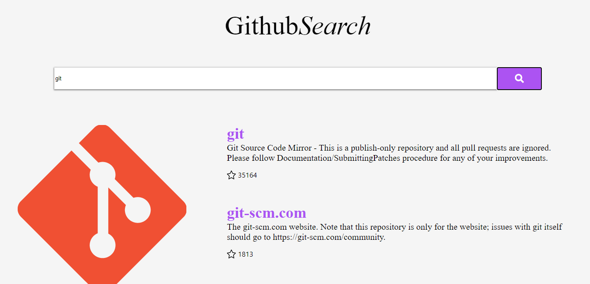
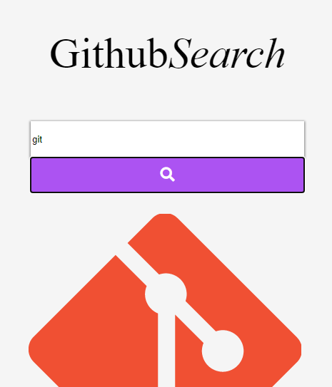
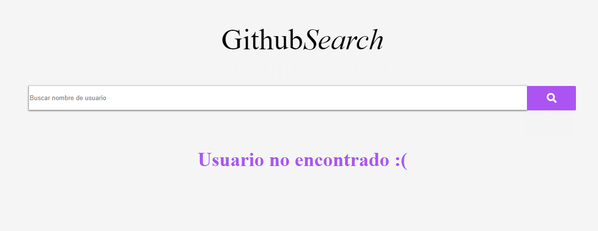

# Desafío Front End

***
## TABLA DE CONTENIDOS :scroll:   
* [1. Desafio](##1-DESAFIO)
* [2. Uso](##2-USO)
* [3. Vistas](##3-VISTAS)
* [4. Deploy](##4-DEPLOY)
* [5. Instalacion](##5-INSTALACION)
***
## 1. DESAFIO :pencil:
Implementar una aplicación web que consuma la API de GitHub y mostrar el perfil de un usuario y 
sus repositorios al buscar su nombre.
***    
## 2. USO :pencil:
Para probar la aplicación, simplemente deberás escribir el nombre del usuario que deseas visualizar
en el campo de texto y hacer click en el botón de búsqueda. Si el usuario no existe, la aplicación
te mostrará un mensaje indicando que el usuario no ha sido encontrado. Si el usuario existe, podrás
visualizar su foto de perfil, sus repositorios en orden según cantidad de estrellas, entre otros.
Al hacer click en el nombre o imagen de perfil, podrás ir a su perfil en GitHub.
También puedes ingresar a través de un celular.
***  
## 3. VISTAS :pencil:
• Usuario encontrado

 
• Usuario encontrado en celular

 
• Usuario no encontrado 
 
*** 
## 4. DEPLOY :pencil:
• Puedes probar la aplicación [aquí](link)
***    
## 5. INSTALACION :pencil:
• Paso 1: Clone el repositorio
• Paso 2: En la terminal, ingrese a la carpeta github-search-app
• Paso 3: Ejecute npm install para instalar dependencias

