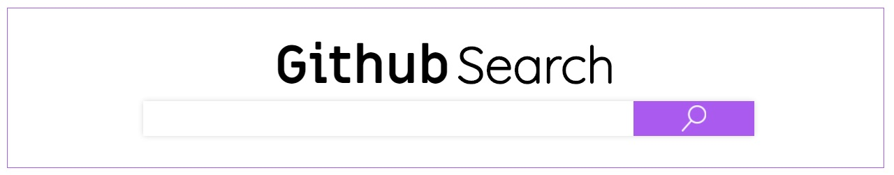

# DESAFÍO FRONT END

## 1 - Deploy del proyecto
Si quieres mirar la demo del proyecto, haz [click aquí](https://githubsearch-recruiting.web.app/)

## 2 - Interacciones
Para interactuar con la app, será necesario escribir el *nombre de usuario* de gitHub en el buscador principal. Si el usuario existe, la app arrojará datos personales de interes como la foto de perfil, nombre, nombre de usuario, email, entre otros, además de la información de todos sus repositorios ordenados decrecientemente por el número de estrellas. En su defecto si el nombre de usuario ingresado no exite, la página arrojará un mensaje de error.
Cabe destacar que esta aplicación web es totalmente **RESPONSIVA**, pudiendo ser utilizada en dispositivos **Web**, **tablet** y **smartphone**.

## 3- Tecnologías utilizadas
Para este proyecto se realizo con **React (Hooks)** y **Sass** como procesador css.

## 4 - Requisitos del proyecto

- Yo, como usuario, quiero buscar un usuario de GitHub;
- Yo, como usuario, deseo ver los detalles de aquel usuario que fue buscado (número de seguidores, imagen del avatar, e-mail y bio);
- Yo, como usuario, en la pantalla de detalhes puedo hacer una nueva busca;
- Yo, como usuario, deseo ver la lista de repositorios de aquel usuario que fue buscado, ordenada por el número decreciente de estrellas;
- Yo, como usuario, en la pantalla de detalhes puedo hacer click en nombre de repositorio e ir para pantalla del repositorio en github;
- Yo, como usuario, en la pantalla de detalhes puedo hacer click en nombre usuariio y imagem del perfil, y ir para pantalla de perfil en github;
