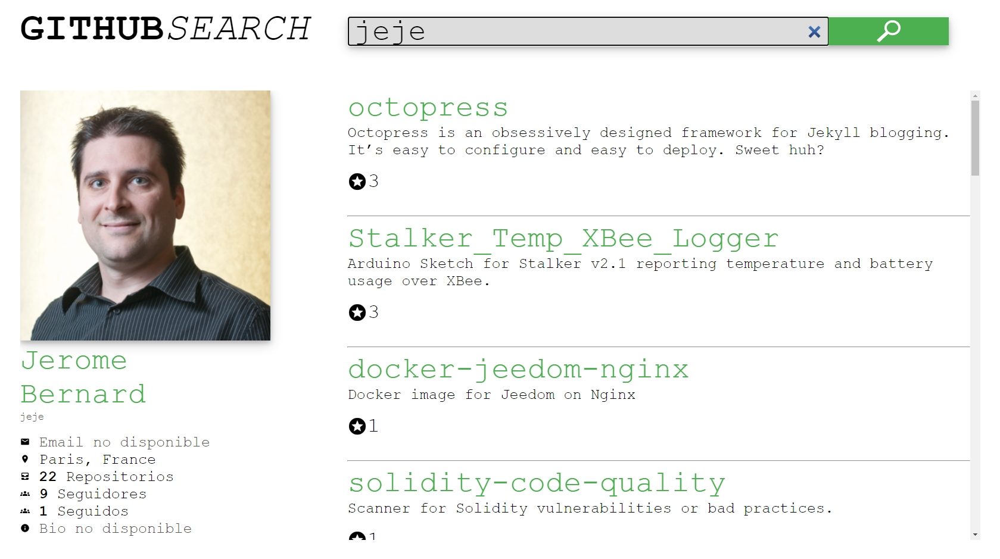
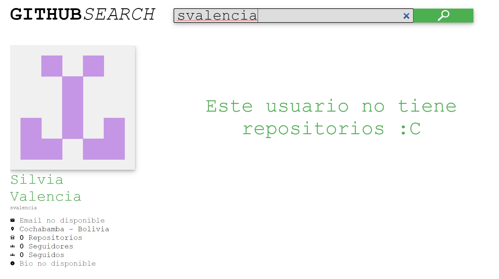

# :grin: ¡Hola!

Soy Sebastian Valencia Lasprilla y esta es mi propuesta de aplicación web que cumple con el Desafío Front End de Accenture.

## :bookmark_tabs: Indice

-
- 1. ¿Qué desarrollé?
- 2. Características
- 3. Ejecutar la aplicación en un ambiente local
- 4. Generar Build del proyecto
- 5. Realizar test unitarios
- 6. Para ayuda futura

## :red_circle: ¿Qué desarrollé?

Aplicación desplegada: https://desafio-accenture-svl.herokuapp.com/

Esta es una aplicación desarrollada con:
- Visual Studio Code
- Angular
- Node.js
- TypeScript
- Scss
- Postman

Que utiliza apis de GitHub para buscar un usuario y obtener la información publica asociada a su cuenta y sus respectivos repositorios.
Esta aplicación fue desarrollada para exploradores de escritorio, a pesar de no estar diseñada para otros dispositivos como tablets o celulares, el tamaño y posición de sus elementos están definidos con vh (viewport width) y vw (viewport height), por lo que no se deformaran o reposicionaran de una manera inesperada.

## :large_blue_circle: Características:

### :small_orange_diamond: Esta aplicación cuenta con un componente Home

### :small_orange_diamond: Y un componente Details

### :small_orange_diamond: El componente Details esta dispuesto para mostrar:

- Avatar, nombre, nickname, locación, numero de repositorios, cantidad de seguidores, cantidad de seguidos y biografía.
- Nombre de repositorios, descripción y estrellas de calificación.

### :small_orange_diamond: Un layout para usuario inexistente

### :small_orange_diamond: Un layout para usuario sin repositorios

### :small_orange_diamond: Y layout para limite de busquedas:

(Este limite es el error 403 que el api genera cuando se supera el exceso de busquedas en un tiempo determinado)

## :black_circle: Ejecutar la aplicación en un ambiente local

Esta es una aplicación que funciona con Node.Js (https://nodejs.org/es/download/) y Angular (https://cli.angular.io/)

- Podemos obtener la aplicación clonando el repositorio con Git o descargandola directamente desde este cliente de GitHub.
- Antes de ejecutar la aplicación debemos asegurarnos de tener las depedencias (node_modules) propias de la aplicación, esto podemos conseguirlo ejecutando el comando `npm install` en la ruta raiz de la aplicación.
- Con el comando `ng serve` lanzaremos la aplicación en un servidor de desarrollo al que podremos acceder en `http://localhost:4200/`

## :red_circle: Generar Build del proyecto

Para generar una Build de este proyecto basta con ejecutar el comando `ng build` en la raiz de la app.

## :large_blue_circle: Realizar test unitarios

Para realizar un test unitario debemos ingresar el comando `ng test`.

## :black_circle: Para ayuda futura

No dudes en contactarme a traves de esta cuenta de gitHub, escribiendo algun comentario en el repositorio o escribiendo al siguiente correo: *se.valas@outlook.com*

# :smiley: Muchas Gracias por darle una oportunidad a mi app.

