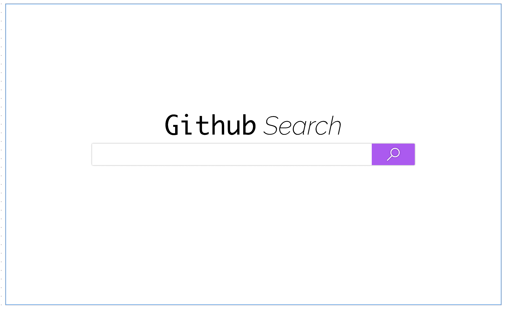
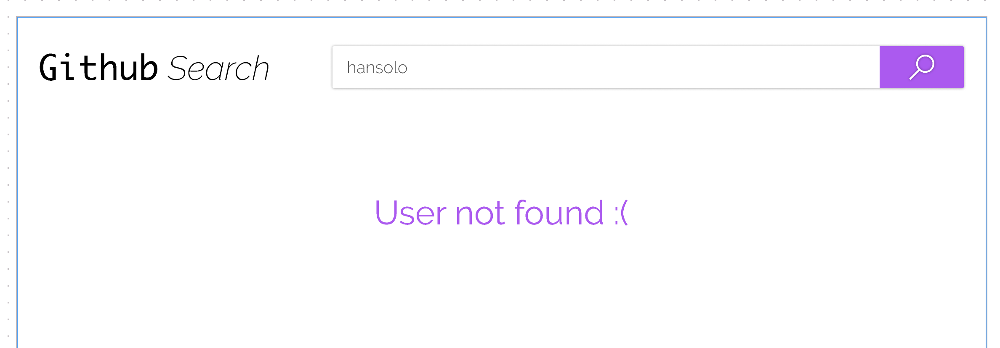

# Desafío Front End

## Propuesta

Implemente una aplicación cliente, visualice la API de GitHub y vea los repositorios de un usuario específico.

Esta aplicación debe funcionar en los navegadores más recientes del mercado.

### API

https://developer.github.com/v3/

Puntos de Detalles de un usuario:

https://api.github.com/users/{username}

Repositorios de un usuario:

https://api.github.com/users/{username}/repos

### Disposición

Home

Details

Not Found

### Navegación

Al buscar un usuario por el login de búsqueda de github, acceda a la página de resultados de la búsqueda con los detalles del usuario, de lo contrario, mostrará la página de Not Found (Layout NotFound).

### Requisitos

- Yo, como usuario, quiero buscar un usuario de GitHub;
- Yo, como usuario, deseo ver los detalles de aquel usuario que fue buscado (número de seguidores, imagen del avatar, e-mail y bio);
- Yo, como usuario, en la pantalla de detalhes puedo hacer una nueva busca;
- Yo, como usuario, deseo ver la lista de repositorios de aquel usuario que fue buscado, ordenada por el número decreciente de estrellas;
- Yo, como usuario, en la pantalla de detalhes puedo hacer click en nombre de repositorio e ir para pantalla del repositorio en github;
- Yo, como usuario, en la pantalla de detalhes puedo hacer click en nombre usuariio y imagem del perfil, y ir para pantalla de perfil en github;

**Definición de listo**

El proyecto debe ser implementado de acuerdo con las especificaciones de Zeplin, no es obligatorio usar una estructura, pero recomendamos el React.js, Angular, Vue, o algún FW más actual. El uso de rutas es obligatorio (Ex: / users / {username} / repos).

### Criterios de evaluación

Buscamos personas que buscan siempre aprender cosas nuevas y estar actualizadas con el Mercado, disfrutar de buenas prácticas y calidad.

- Organización del proyecto: La estructura del proyecto, documentación y uso del control de versión;
- Innovación tecnológica: el uso de nuevas tecnologías, siempre que sean estables;
- Consistencia: Si se cumplen los requisitos;
- Buenas prácticas: Si el proyecto sigue buenas prácticas de desarrollo, incluyendo seguridad, optimización, código limpio y reutilizable, etc;
- Control de Calidad: Si el proyecto tiene calidad asegurada por pruebas unitarias (por ejemplo, Jasmine, Mocha, Chai, Jest, etc).
- No utilice Frameworks CSS (Boostrap, Material Angular, etc). Queremos entender cuál es su conocimiento con CSS.
- El uso de preprocesador es muy bienvenido (Sass, Less) y ganará puntos.
- El layout propuesto es bastante simple, pero tiene puntos que pueden ser reutilizados, reflexione sobre lo que se puede crear como componente. Analice bien el diseño y lo que se repite. Monte su biblioteca de componentes. Sugerencia, un término muy utilizado es webcomponent.
- Documentación del proyecto, en el README.md debe ser creado y explicadar como se puede levantar la aplicacion en ambiente local, ejecutar pruebas unitarias, etc.
- Git, el control de versión se analizará también, por lo que los commits, descripciones que se hizo en aquel commit también contará en el análisis.
- Nomenclatura, el idioma para el código base debe estar en inglés y el idioma dirigido para el usuario en Español.
- Requerimiento obligatorio: la página de busqueda debe pertenecer a un modulo diferente de la página de detalle.
- El layout que esta en Zeplin se comparte cuando nuestro Recursos Humanos entran en contacto, y el css que es generado por él no debe ser utilizado. El foco es crear algo de cero y pensando en los webcomponentes reutilizables.

Cada ítem arriba será evaluado y contará puntos en la evaluación final, por lo tanto aplique todo su conocimiento.

### Entrega

Siga los siguientes pasos para implementar y enviar este desafío:
- Haga un **Fork** a este repositorio. Puedes mirar esta guía para mayores informaciones: [Como hacer fork de un repositorio](https://help.github.com/en/articles/fork-a-repo).
- Implemente el desafío.
- Después de completar el desafío, realice un **Pull Request** a este repositorio, utilizando la interface de **Github**. [Creando un Pull Request](https://help.github.com/en/articles/creating-a-pull-request-from-a-fork).
- Si es posible, deja tu repositorio publico para hacer la revisión de código más sencilla.

Ademas de eso, la aplicación debe alojarse (Heroku, Netlify, Firebase, Plunker, etc.) y cumplir con los requerimientos. Las direcciones URL deben ser agregadas a el README del proyecto.

### Plazo

El tiempo de entrega de 7 días.

Si el equipo de Recursos Humanos no te ha contactado, escribe a trabajeconnosotros@concrete.com.br

¡Buena suerte!
